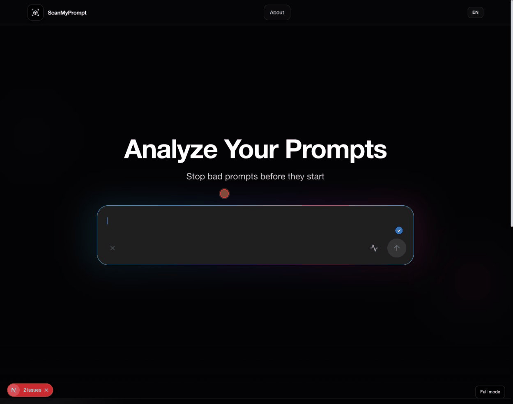

# ScanMyPrompt

AI Prompt Security & Quality Analyzer — free, private, runs in your browser.



[Live Demo](https://scan-my-prompt.vercel.app) | EN/FR

## What it does

- **Security analysis** — 58 regex patterns across 6 OWASP LLM Top 10 categories
- **Quality scoring** — 6 dimensions (context, specificity, structure, constraints, clarity, examples)
- **AI insights** — powered by Llama 3 via Groq (optional, server-side key)
- **Safe rewrite** — automatic sanitization of detected threats
- **Export report** — download a Markdown report for documentation

## Privacy

All heuristic analysis runs 100% in your browser. No data is sent to any server.
The optional AI insights feature sends the prompt to Groq's API via a server-side proxy.

## Tech Stack

Next.js 16 (App Router) · React 19 · TypeScript · Tailwind CSS v4

## Getting Started

```bash
npm install
cp .env.example .env.local  # Add your GROQ_API_KEY (optional)
npm run dev
```

Open [http://localhost:3000](http://localhost:3000) in your browser.

## Environment Variables

| Variable | Required | Description |
|----------|----------|-------------|
| `GROQ_API_KEY` | No | Groq API key for AI insights. Get one free at [console.groq.com](https://console.groq.com) |

## Build

```bash
npm run build
```

## License

MIT
